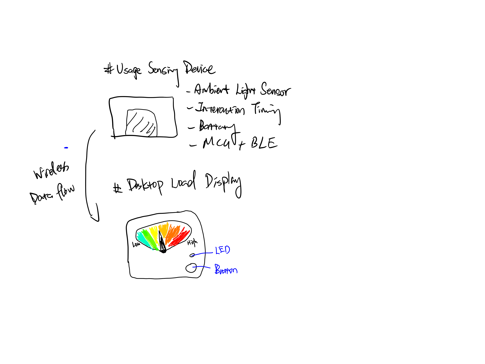
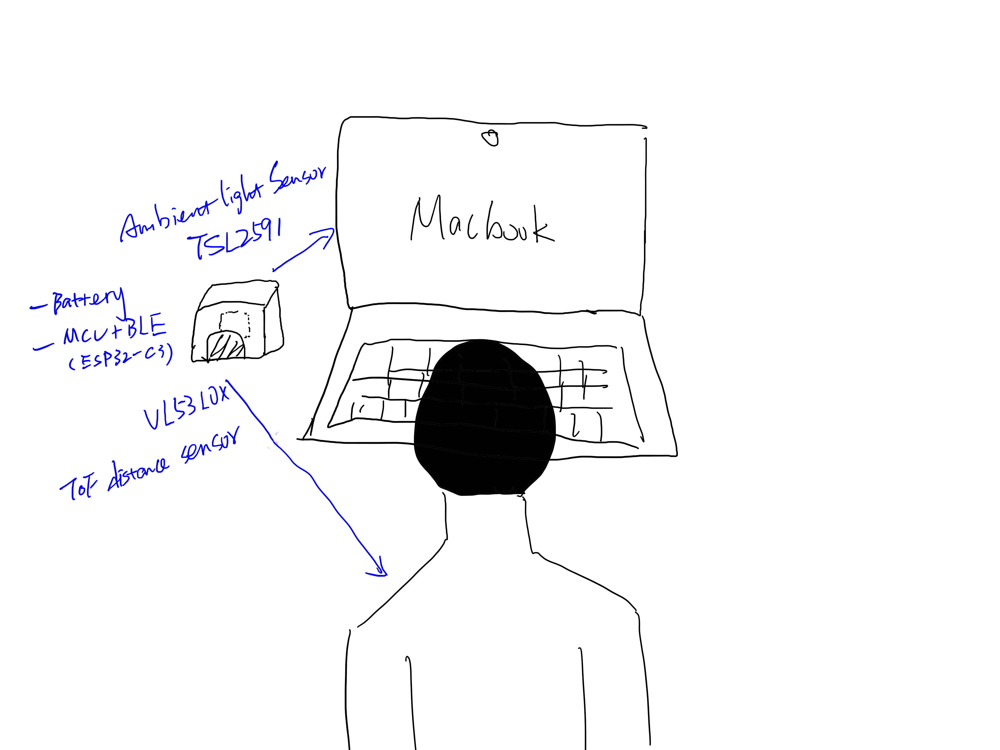
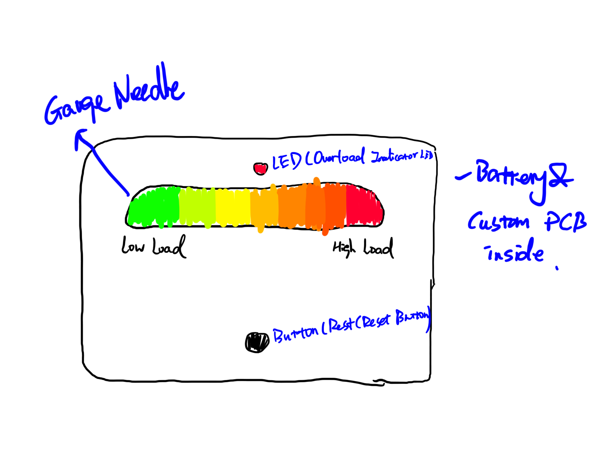
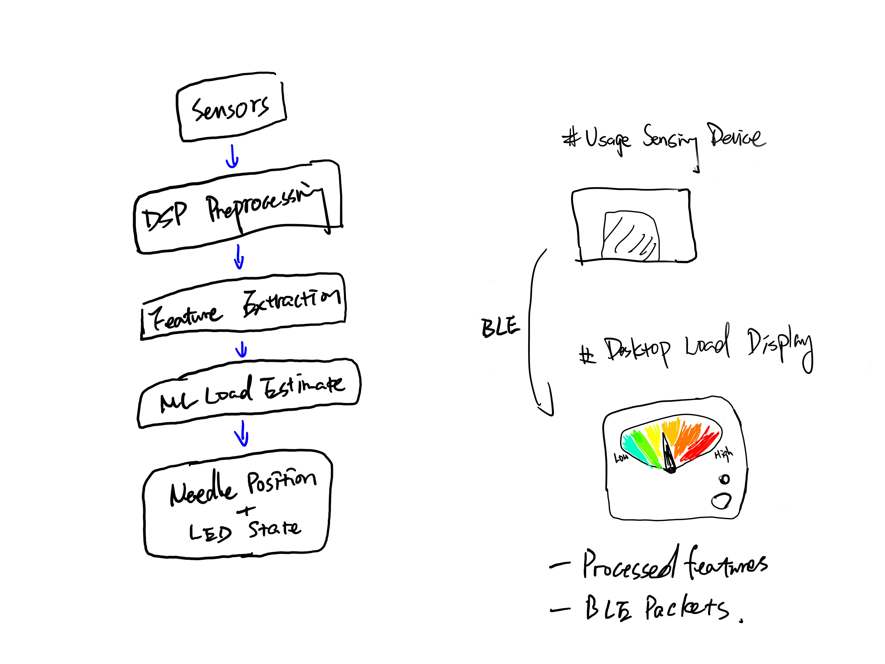

# Screen Usage Load Meter

## 1. Project Overview

### What it does
Screen Usage Load Meter is a two-device system that estimates a user’s screen usage load based on usage intensity and continuity.  
A sensing device placed near a screen detects usage patterns, while a desktop display device visualizes the accumulated load using an analog gauge with a stepper motor.

### General Physical Sketch
The system consists of a small sensing module mounted near a computer screen and a desktop gauge display with a needle, LED, and button.

---

## 2. Sensor Device

The sensor device is a compact, battery-powered module placed near a computer screen.  
It passively detects screen usage behavior without accessing the operating system and wirelessly transmits processed data to the display device.

### Sensors and Part Numbers
- **Ambient Light Sensor:** TSL2591  
  Used to detect screen-on activity and relative brightness changes.
- **Time-of-Flight Distance Sensor:** VL53L0X  
  Used to detect user presence in front of the screen.

### Processor and Wireless
- **MCU + Wireless:** Seeed Studio XIAO ESP32C3 (ESP32-C3, Bluetooth Low Energy)

### Power
- 3.7V LiPo battery (500–1000 mAh)
- Low-duty-cycle operation for extended battery life

### Sensor Device Sketch
The sensing module is mounted near the display, with the light sensor facing the screen and the distance sensor facing the user.  
The device operates autonomously and does not include user-facing controls.

---

## 3. Display Device

The display device is a desktop physical gauge that visualizes the current screen usage load.  
It integrates a stepper-motor-driven needle, an LED indicator, and a user button, and hosts the custom PCB for the project.

### Interface Components
- **Stepper Motor:** 28BYJ-48 (5V)  
  Drives the gauge needle to indicate load level.
- **Stepper Driver:** ULN2003A
- **LED:** WS2812B (single RGB LED for status indication)
- **Button:** Momentary tactile switch (e.g., B3U-1000P)

### Processor and Wireless
- **MCU + Wireless:** Seeed Studio XIAO ESP32C3  
  Receives data from the sensor device via BLE and performs load computation.

### Power
- 3.7V LiPo battery (~1000 mAh)
- Boost converter (e.g., MT3608) to supply 5V for the stepper motor

### Display Device Sketch
The display features a circular gauge with a needle ranging from low to high usage load.  
An LED provides overload warnings, and a button allows the user to mark rest periods or reset the display.

---

## 4. Communication and System Diagram

The sensor device continuously transmits processed usage features to the display device using Bluetooth Low Energy (BLE). The system converts raw sensor signals into a cumulative screen usage load score that controls the gauge needle and LED state.

**Data Flow:**
1. Sensor signals (ambient light and distance)
2. DSP preprocessing (filtering, windowing, continuity detection)
3. Feature extraction (usage duration, intensity, continuity)
4. ML-based baseline learning and load estimation
5. Output mapping to needle position and LED state

---

## 5. DSP and ML Approach

- **DSP:**  
  Sliding window analysis, signal filtering, and exponential decay modeling are used to compute cumulative screen usage load.
- **ML:**  
  A lightweight model learns a personal baseline of screen usage behavior and estimates overload risk relative to that baseline.

---

## 6. Datasheets

All component datasheets are included in the `/datasheets` folder, including:

- ESP32-C3 (Seeed Studio XIAO ESP32C3)
- TSL2591 Ambient Light Sensor
- VL53L0X Time-of-Flight Distance Sensor
- 28BYJ-48 Stepper Motor
- ULN2003A Stepper Motor Driver
- WS2812B RGB LED
- Power management components (e.g., MT3608 boost converter)
