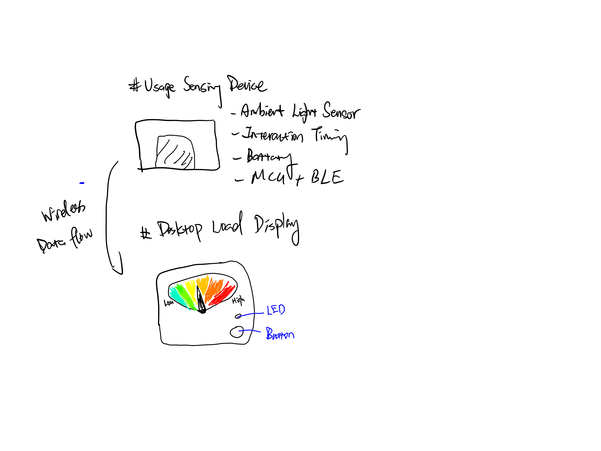
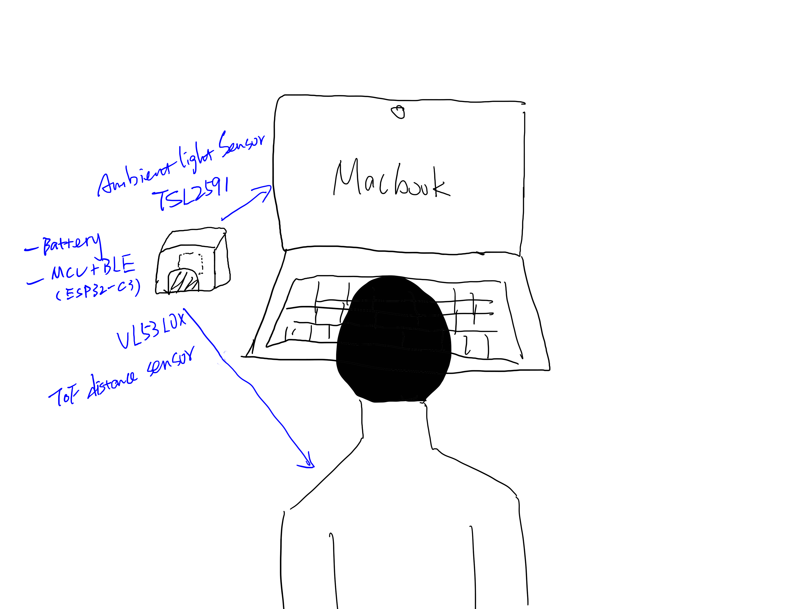
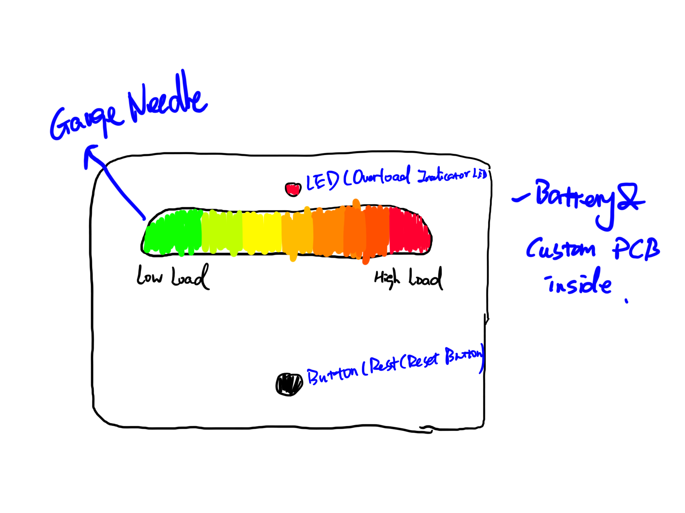
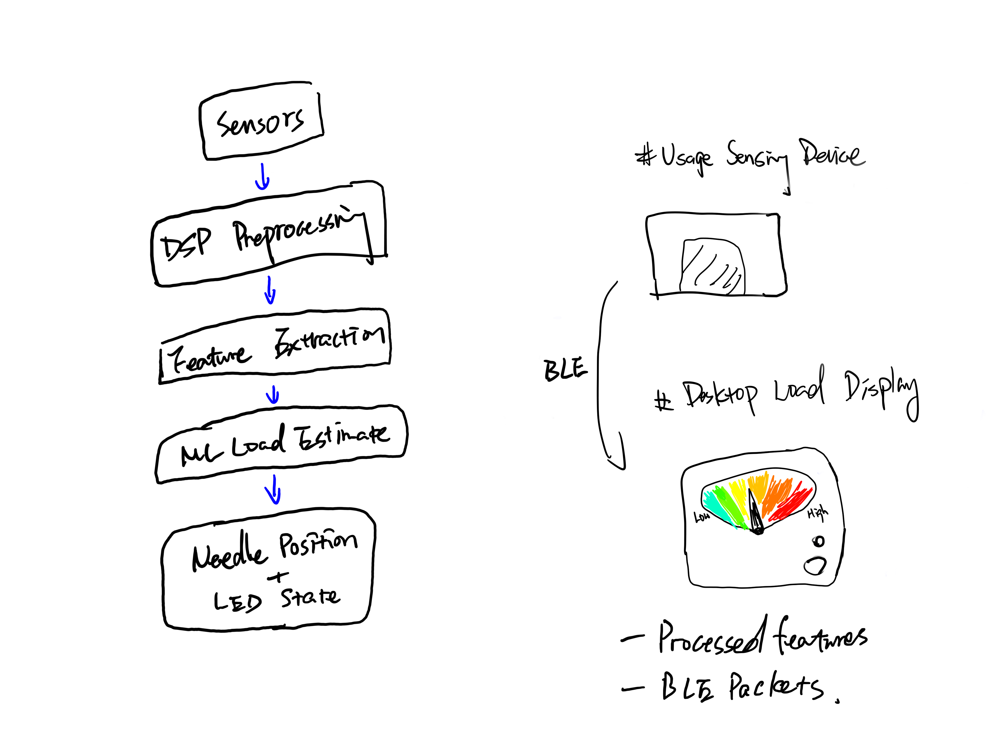

# Screen Usage Load Meter

## 1. Project Overview

### What it does

Screen Usage Load Meter is a two-device system that estimates a user's screen usage load based on ambient light and user presence detection.  
A sensing device placed near a screen detects usage patterns, while a desktop display device visualizes the accumulated load using an analog gauge with a stepper motor and LED indicator.

### General Physical Sketch

The system consists of a small sensing module mounted near a computer screen and a desktop gauge display with a needle and LED.

---

## 2. Sensor Device

The sensor device is a compact, battery-powered module placed near a computer screen.  
It passively detects screen usage behavior without accessing the operating system and wirelessly transmits processed data to the display device via ESP-NOW.

### Sensors and Part Numbers

- **Ambient Light Sensor:** VEML7700 (Adafruit breakout)  
  Used to detect screen-on activity based on lux threshold (< 30 lux = screen off).
- **Time-of-Flight Distance Sensor:** VL53L4CX (Adafruit breakout)  
  Used to detect user presence in front of the screen (> 800mm = no person).

### Processor and Wireless

- **MCU + Wireless:** Seeed Studio XIAO ESP32C3 (ESP32-C3, ESP-NOW over Wi-Fi)

### Power

- 3.7V LiPo battery (1000 mAh)
- Onboard charging via XIAO ESP32C3 built-in battery management

### Sensor Device Sketch

The sensing module is mounted near the display, with the light sensor facing the screen and the distance sensor facing the user.  
The device operates autonomously and does not include user-facing controls.

---

## 3. Display Device

The display device is a desktop physical gauge that visualizes the current screen usage load.  
It integrates a stepper-motor-driven needle and an LED indicator, connected via breadboard prototype.

### Interface Components

- **Stepper Motor:** X27.168 bipolar gauge motor  
  Drives the gauge needle (2° per minute, full range 360°, returns to origin at 180 minutes).
- **LED:** NeoPixel WS2812B (single RGB LED for status indication)  
  Green (0–60 min) → Yellow (60–120 min) → Orange (120–180 min) → Bright Red (180+ min)

### Processor and Wireless

- **MCU + Wireless:** Seeed Studio XIAO ESP32C3  
  Receives data from the sensor device via ESP-NOW and controls motor and LED output.

### Power

- USB 5V (runs alongside computer)

### Display Device Sketch

The display features a gauge with a needle indicating cumulative usage load.  
An LED provides color-coded status, changing color every hour to indicate increasing usage intensity.

---

## 4. Communication and System Diagram

The sensor device continuously transmits processed usage data to the display device using **ESP-NOW** (peer-to-peer Wi-Fi protocol, no router required). The system converts raw sensor signals into a cumulative screen usage time that controls the gauge needle position and LED color state.

**Data Flow:**

1. Sensor signals (ambient light lux + distance mm)
2. Threshold logic (lux < 30 = screen off; distance > 800mm = no person)
3. Usage timer accumulation (seconds counted when both conditions met)
4. ESP-NOW transmission (minutes sent every second to display device)
5. Output mapping to needle position (2°/min) and LED color stage

---

## 5. DSP and Signal Processing Approach

- **DSP:**  
  Dual-threshold detection logic combines ambient light and distance signals. Screen-off state is detected when lux drops below 30. User absence is detected when ToF distance exceeds 800mm. Usage time accumulates only when both sensors confirm active use simultaneously.
- **Note:**  
  No ML model is used in the current implementation. Detection is rule-based with fixed thresholds calibrated to typical indoor desktop environments. False positive rate is approximately 5%, primarily caused by ambient light changes such as overhead lighting.

---

## 6. Datasheets

All component datasheets are included in the `/datasheets` folder, including:

- ESP32-C3 (Seeed Studio XIAO ESP32C3)
- VEML7700 Ambient Light Sensor (Vishay / Adafruit breakout)
- VL53L4CX Time-of-Flight Distance Sensor (ST / Adafruit breakout)
- X27.168 Bipolar Gauge Stepper Motor (Switec/Juken)
- WS2812B RGB LED (NeoPixel)
- Custom Sensor Board PCB (KiCad design files)
